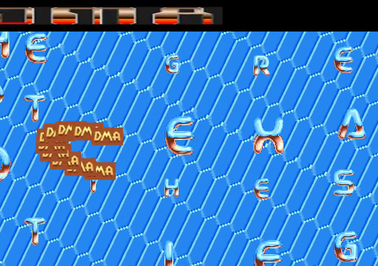
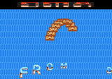

# VIVA TCB

Remake Go/Ebitengine de l’écran VIVA TCB. Le même cœur de jeu alimente la
version ordinateur et l’application Android.

La musique `assets/music.ym` est synthétisée par `ym-player` à 48 kHz, puis
envoyée à l’audio Ebitengine sous forme PCM 16 bits stéréo. L’initialisation de
l’audio est différée au premier `Update` pour respecter le cycle de vie Android.

<!-- Project showcase -->
## Screenshots

[](docs/media/screenshot-1.png)

DMA music meters and scattered metallic letters over the blue honeycomb backdrop.

## Video

[](https://github.com/olivierh59500/viva_tcb/raw/refs/heads/main/docs/media/preview.mp4)

**[Watch or download the 24-second MP4 preview with sound](https://github.com/olivierh59500/viva_tcb/raw/refs/heads/main/docs/media/preview.mp4)**

This preview is captured from the Go production.

The animated image is silent; the MP4 includes the soundtrack.

<!-- End project showcase -->

## Ordinateur

```sh
go run ./cmd/vivatcb
```

## Android

Pré-requis validés : Go 1.25 ou ultérieur, JDK 17, Android SDK/API 36, NDK r28
et un appareil Android autorisé via USB.

Pour construire l’AAR arm64 et l’APK debug, installer l’application puis la
lancer sur l’unique appareil connecté :

```sh
./scripts/run-android.sh
```

Artefacts générés :

```text
android/app/libs/vivatcb.aar
android/app/build/outputs/apk/debug/app-debug.apk
```

L’application utilise l’identifiant `com.olivierh.vivatcb`, le mode immersif
et les deux orientations paysage. Ebitengine conserve le canvas logique
768 × 540 et le centre sans déformation sur les écrans plus larges.

## Vérifications

```sh
go test ./...
go test -race ./...
go vet ./...
golangci-lint run
```

## Optional DCK version

The original implementation remains at its original paths. Run it with `go run ./cmd/vivatcb`.

The construction-kit version is in [dck/](dck/README.md). Run `go run ./dck/cmd/vivatcb` from this directory. Both versions share the original assets.
